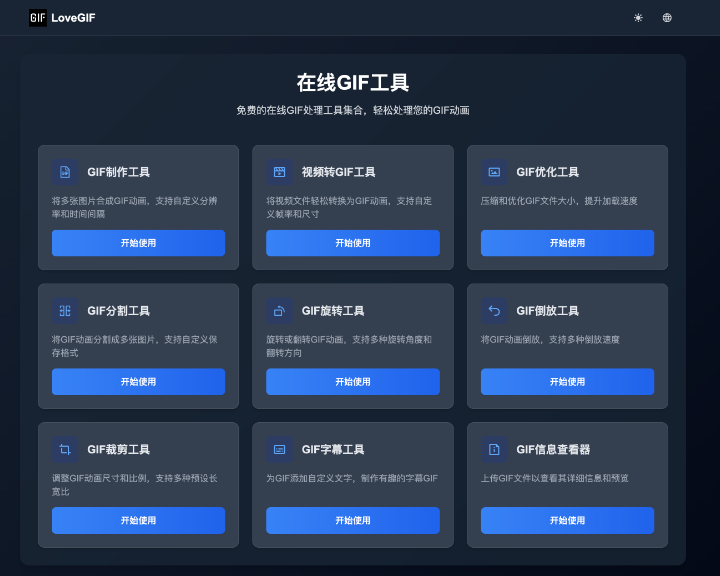

# LoveGIF

  

[English Version](README.md) | [中文版](README_CN.md)

LoveGIF 是一个功能强大的 GIF 动画处理工具，旨在为用户提供全面的 GIF 创建、编辑和优化解决方案。无论您是想制作新的 GIF 动画，还是对现有的 GIF 进行编辑和优化，LoveGIF 都能满足您的需求。

  

## 项目地址

[LoveGIF 官方网站](https://www.lovegif.top/)

## 功能特性

- **GIF 制作**：从视频或图片序列中轻松创建高质量的 GIF 动画。
- **格式转换**：支持将视频转换为 GIF 格式，方便快捷。
- **GIF 优化**：通过压缩和优化技术，减少 GIF 文件大小，提高加载速度。
- **GIF 分割**：将 GIF 动画分割为多个帧，便于编辑和处理。
- **旋转和裁剪**：支持对 GIF 动画进行旋转和裁剪，调整到您需要的尺寸和角度。
- **反转播放**：让您的 GIF 动画可以反向播放，创造独特的视觉效果。
- **添加文本**：在 GIF 上添加字幕或文字说明，增强表达效果。
- **信息查看**：查看 GIF 动画的详细信息，包括帧数、分辨率等。

## 问题反馈

如果您在使用过程中遇到任何问题，欢迎通过 GitHub 提交 issue，我们会尽快进行处理。